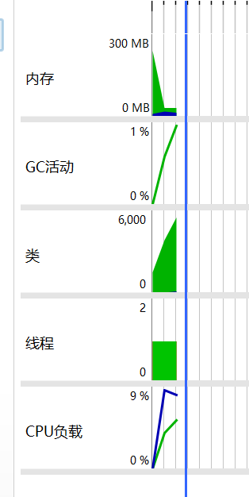
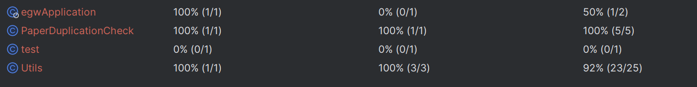

# 软工:第二次作业

## PSP表格:

| PSP2.1                                  | Personal Software Process Stages        | 预估耗时（分钟） | 实际耗时（分钟） |
| --------------------------------------- | --------------------------------------- | ---------------- | ---------------- |
| Planning                                | 计划                                    | **20**           | **23**           |
| · Estimate                              | · 估计这个任务需要多少时间              | 20               | 23               |
| Development                             | 开发                                    | **330**          | **347**          |
| · Analysis                              | · 需求分析 (包括学习新技术)             | 60               | 70               |
| · Design Spec                           | · 生成设计文档                          | 30               | 22               |
| · Design Review                         | · 设计复审                              | 10               | 8                |
| · Coding Standard                       | · 代码规范 (为目前的开发制定合适的规范) | 30               | 23               |
| · Design                                | · 具体设计                              | 50               | 38               |
| · Coding                                | · 具体编码                              | 90               | 100              |
| · Code Review                           | · 代码复审                              | 30               | 44               |
| · Test                                  | · 测试（自我测试，修改代码，提交修改）  | 30               | 42               |
| Reporting                               | 报告                                    | 70****           | **61**           |
| · Test Repor                            | · 测试报告                              | 20               | 18               |
| · Size Measurement                      | · 计算工作量                            | 30               | 33               |
| · Postmortem & Process Improvement Plan | · 事后总结, 并提出过程改进计划          | 20               | 10               |
|                                         | · 合计                                  | **420**          | **431**          |

## Jar包使用说明

- 需要使用版本为17的JDK运行
- 可运行JAR包为release包中的egw.jar包

## 模块设计

- 实现代码为Java
- 主方法paperDuplicationCheck(String originFilePath,String copyFilePath,String resultFilePath): 负责调用各个函数实现论文查重的一套流程
- Utils类:负责封装paperDuplicationCheck方法中所调用的所有方法
  - public static String FileToString(String FilePath): 负责将文件中的文本转换为一个长字符串
  -  public static double jaccardCal(String origin,String copy): 负责将字符串做预处理并计算jaccard系数,求出相似度
  - public static void writeToFile(String filePath,Double data): 将结果输出到目标文件中
- test类: 打成jar包后, 为命令行输入参数, 来调试程序的类
- egwApplication类: spring框架的启动类
- 测试包中的EgwApplicationTests类: 封装了所有的单元测试的案例

## 性能分析

- 性能耗费最大的函数为jaccardCal, 它涉及到了文字的预处理, 包括存取等行为

## 单元测试

- 单元测试测试了抛异常的情况, 会提示"文件找不到","文件没有实际内容"的异常
- 单元测试还测试正常的案例,输入输出的情况
- 测试了完全相同的文件是否相似度为100%
- 部分相同的文件是否能达到一定的相似度的答案输出
- 测试覆盖率图片:

## 异常处理

- 异常采用try-catch来处理,
- IOEexcption, 通常为文件路径有误时提醒文字找不到文件
- ArithmeticException,除数为0的情况,实际是因为文件没有内容导致的分母为0,因此会提醒文件没有实际内容的提示词.

