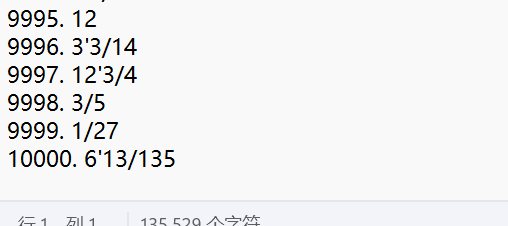
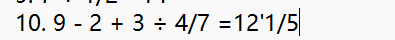

# 结对项目

| GitHub地址           | [GitHub地址](https://github.com/wjiez/wjiez/tree/main/3123004197/exerciseGeneration) |
| -------------------- | ------------------------------------------------------------ |
| 这个作业属于哪个课程 | [班级的链接](https://edu.cnblogs.com/campus/gdgy/SoftwareEngineeringClassof2023) |
| 这个作业要求在哪里   | [作业要求的链接](https://edu.cnblogs.com/campus/gdgy/SoftwareEngineeringClassof2023/homework/13326) |
| 这个作业的目标       | 实现随机生成四则运算题目的程序                               |
| 成员                 | 魏杰宗3123004197&&崔嘉豪3123004264                           |

## PSP表

| PSP2.1                                  | Personal Software Process Stages        | 预估耗时（分钟） | 实际耗时（分钟） |
| --------------------------------------- | --------------------------------------- | ---------------- | ---------------- |
| Planning                                | 计划                                    | **40**           | **45**           |
| · Estimate                              | · 估计这个任务需要多少时间              | 40               | 45               |
| Development                             | 开发                                    | **520**          | **511**          |
| · Analysis                              | · 需求分析 (包括学习新技术)             | 60               | 66               |
| · Design Spec                           | · 生成设计文档                          | 60               | 55               |
| · Design Review                         | · 设计复审                              | 5                | 8                |
| · Coding Standard                       | · 代码规范 (为目前的开发制定合适的规范) | 15               | 10               |
| · Design                                | · 具体设计                              | 60               | 62               |
| · Coding                                | · 具体编码                              | 200              | 220              |
| · Code Review                           | · 代码复审                              | 60               | 45               |
| · Test                                  | · 测试（自我测试，修改代码，提交修改）  | 60               | 45               |
| Reporting                               | 报告                                    | **70**           | **60**           |
| · Test Repor                            | · 测试报告                              | 40               | 30               |
| · Size Measurement                      | · 计算工作量                            | 20               | 22               |
| · Postmortem & Process Improvement Plan | · 事后总结， 并提出过程改进计划         | 10               | 8                |
|                                         | · 合计                                  | **630**          | **616**          |

## 设计思想：

- 面向对象编程，将需求设计为两个对象
  - 对象一：Data类，代表一个数据，其中成员变量包括整数部分itg，分子部分numerator，分母部分denominator三个，都为对象类型数据Integer.数据类型包括三种，当为整数时，分子分母为空；当为带分数时，是假分数的一种，三个成员变量都不为空；当为真分数时，整数部分为空；
  - 对象二：Exercise类，代表一道题目，其中也有三个成员变量，成员变量一为datas，成员变量二为signs，都为ArrayList类，基类分别为Data类和Character类，分别用于存放一道题的数据和运算符号。而成员变量三为answer， 数据类型为Data，存放这道题的答案。
- 方法设计：
  - 方法1：**Character signGeneration()**， 随机生成一个运算符号，返回一个字符。
  - 方法2：**Data integerGeneration(int maxInt)**，随机生成一个整数，传入参数为数值的限制，即数据要小于这个限制
  - 方法3：**Data fractionGeneration(int maxInt)**，随机生成一个分数，可能为真分数，也可能为带分数，但不可能为整数。
  - 方法4：**void simplify(Data data)**， 用来化简数值，即分子不会大于分母，如果大于，则会化到整数部分，且分子分母不会有公约数，为最简分数，实现思想为辗转相除法求最大公约数。随机生成分数和计算都会用到。
  - 方法5：**Data add(Data a，Data b)**，用于计算两个数据相加结果
  - 方法6：**Data minus(Data a，Data b)**，用于计算两个数据减法运算，当为负数时，会返回null
  - 方法7：**Data multiply(Data a，Data b)**， 用于计算两个数据相乘
  - 方法8：**Data divide(Data a，Data b)**，用于计算两个数据除法运算，除数为0返回null
  - 方法9：**Data cal(Data a，Data b，char sign)**，用于判断运算符，调用对应的运算方法
  - 方法10：**ArrayList\<Object\> toPostfix(Exercise exercise)**， 用于将一道题目转换为后缀表达式，存放至ArrayList中并返回，使用了栈的思想
  - 方法11：**boolean exerciseCal(Exercise exercise)**，计算一道题目，会首先转换后缀表达式，计算后，将答案存放至exercise中的成员变量answer中， 如果计算成功会返回true，否则返回false，计算失败有两种情况，一种是减法得到负数，一种是除法中，除数为0
  - 方法12：**boolean checkDuplication(Exercise a，Exercise b)**，检查两道题目是否重复，实现思想，是先都转换为后缀表达式，然后同步计算比较，只要有一步不同，就表示不重复
  - 方法13：**void exerciseGeneration(ArrayList\<Exercise\> exercises，int numLimit，int dataNum，int exerciseNum，int checkStart)**连续生成多道题目，exercises存放生成的一道道题目，numLimit指定数据不能大于此数值，dataNum指定每道题目中数据的数量（间接影响运算符的数量，作业要求了运算符数量不能大于3），exerciseNum指定了exercises中题目数量的多少，checkStart指定了此次生成的所有题目从索引值为checkStart的地方开始往后查重操作。此方法内部依据dataNum（等于2，不生成括号）是否满足生成括号的条件，随机（是否生成，生成位置）生成括号。
  - 方法14：**void writeToFile(ArrayList\<Exercise\> exercises)**，将题目集合写入文件。作业需求是将生成的题目写入Exercise.txt，答案写入Answer.txt中，所以内部已指定路径为程序同目录下，其中用的是性能还不错的打印流实现。
  - 方法15：**void printData(PrintStream，Data data)**，将writeToFile中打印数据的部分抽离出来成为方法
  - 方法16：**void proofread（String exerciseFilePath， String answerFilePath）**，用于校对题目文件和答案文件，实现了作业要求，即会输出correct（题号），wrong（题号）
- 两个main程序
  - main程序一：为proofread.jar的jar包，使用方法java -jar proofread.jar， 不用指定答案文件和题目文件路径，它会找同目录下的Answer.txt和Exercise.txt。
  - main程序二：为exerciseGeneration.jar的jar包，实现随机生成题目，使用方法Java -jar exerciseGenration.jar 100 10，其中100表示题目数量，10表示数值不大于10。

**注意**：程序为jdk17版本，其他版本可能不能运行

## 测试:

- 覆盖率测试样图:

- 样例展示:

  - 生成题目100道:

    - 题目:

    

    - 答案:

    

  - 生成题目1000道:

    - 题目:

    

    - 答案:

    

  - 生成题目10000道:

    - 题目:

    

    - 答案:

    

    校对答案测试:

    - 首先全对做一次校对， 然后将题目中的第10题改错， 再次实验， 如下图为测试图示

      命令行显示:

      

      测试完全对后修改第10题答案(结果为上图中的第二条执行结果):

    

    

- 测试性能图;

可以看到耗费时间较高的方法为writeToFile， 即写数据到文件中， 可以考虑用更高效的流优化程序时间， 如缓存流等， 还有可以减少I/O的次数，从而减少运行时间

## 项目小结:

- 跳出单一逻辑框架，要理性分析问题，例如题目和数据对象化的思维， 这样操作起来更加清晰，方便

- 面对复杂现象时， 要共同讨论协商， 分享各自的想法
- 问题模块化，将需求分解成一个个方法，逐一实现